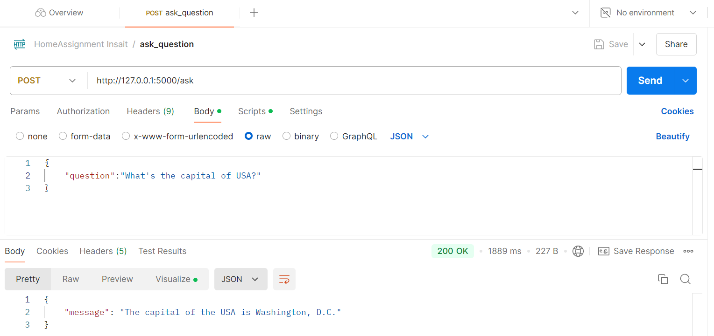

# Insait Home Assignment for Backend Internship

1. Install all the packages:
- Flask
- SQLAlchemy
- OpenAI
- dotenv
- pytest
- requests 
- etc.
all the packages mentioned in **requirements.txt**

2. Create application (**Assignment.py**) with model with 3 columns (id, question, answer)
Create OpenAI integration according official documentation -  https://github.com/openai/openai-python
Create migrations directory for alembic migrations.

3. Test application using pytest and requests - test_endpoint.py
I've decided to test my application also by using Postman. Here's result:

3. Dockerize application and database according documentation - https://docs.docker.com/compose/

