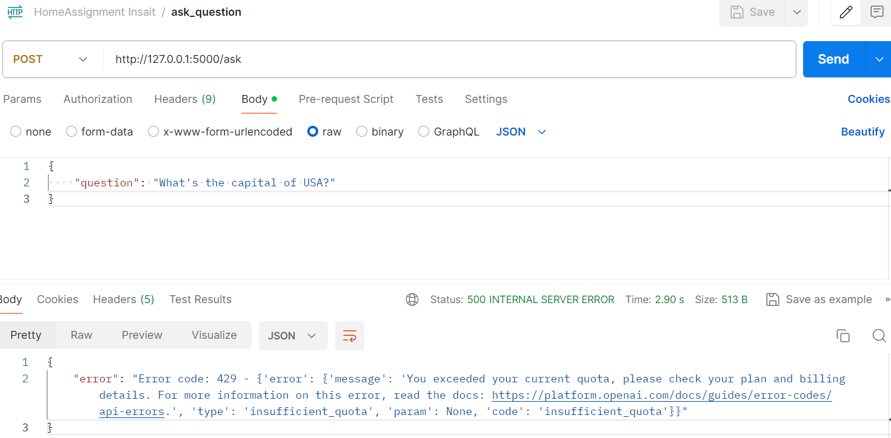

# Insait Home Assignment for Backend Internship

1. Import all the packages:
- Flask
- SQLAlchemy
- OpenAI
- dotenv (for secure using of open AI API key and PostgreSQL password - .env)

2. Install **pytest** for testing and **alembic** for migrations

**OpenAI Python API settings** - https://github.com/openai/openai-python

The main application file is Assignment.py.
Created models.py where you can find db model with 3 columns (id, question, answer)
Created migrations directory for alembic migrations.

I've dockerized the flask application and database according documentation - https://docs.docker.com/compose/

I've decided to test my application by using Postman, but I exceeded my OpenAI API quota.

Because of that I've created test.endpoint.py (tests directory) to test API endpoint using pytest